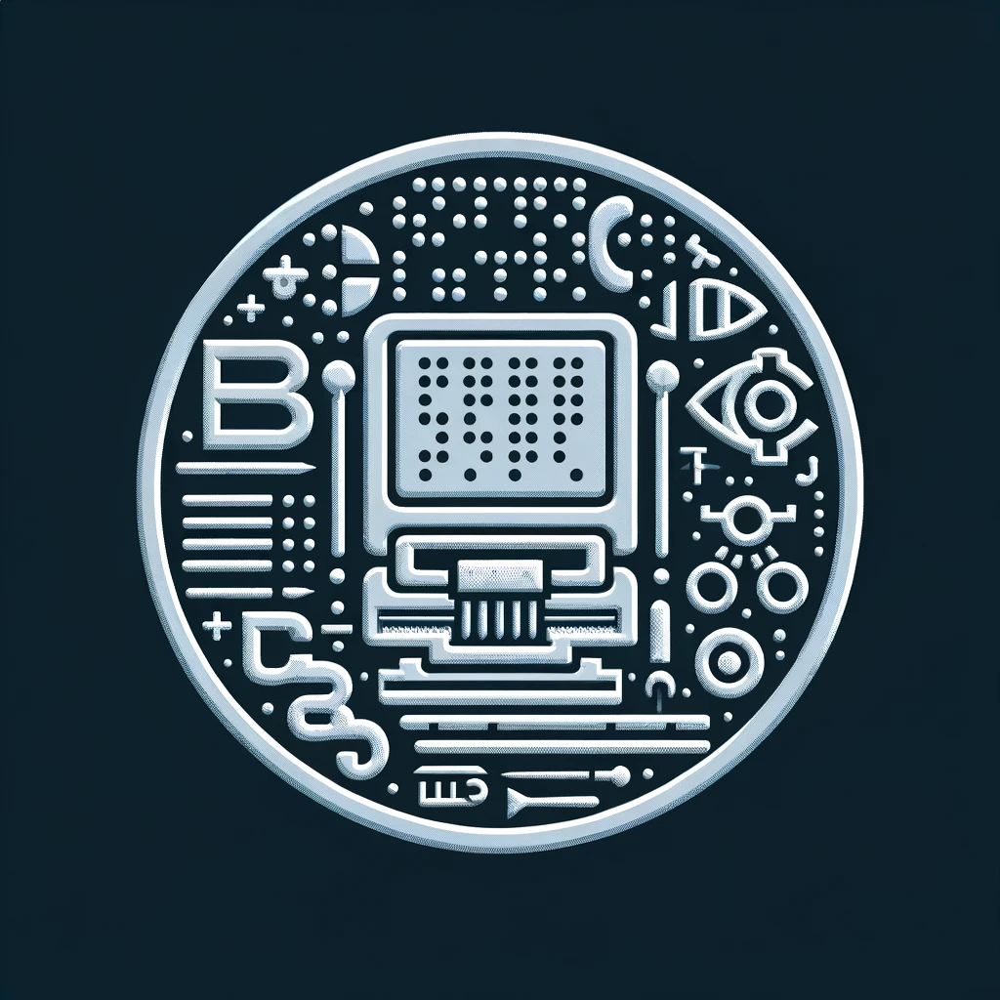

# BrailleSculpt                




An English to Brail translator that 3d Prints.

## Description

This project stemmed from my interest to learn more about the world of Deep Learning. I wanted to learn more about Long Short Term Memory (LSTM) Neural Networks. I never previously got the opportunity to learn to build with JAX and Haiku so I thought this is a good opportunity. Also, I wanted to create an easy and mostly free way to get some braille, maybe if you need to make a sign, or you are a teacher that wants to help accommadate a vision-impaired student.

This project involves developing a machine learning application to convert text into Braille, a tactile writing system used by people who are visually impaired. The core of the project is a neural network model, likely implemented using JAX, a high-performance numerical computing library. The model is trained to predict Braille representations of text characters, and the training process is managed by a function named `train_model`. The application uses a modified `encode_character` function to convert input text into a format suitable for model prediction. Each character of the input text is encoded, reshaped, and then passed through the `predict_braille` function, which applies the trained neural network model to predict the Braille equivalent. The output predictions for each character are then combined and validated against the correct Braille translation using the `validate_result` function. Finally `run.py` puts it all together. It is put into your downloads file as a stl file then automatically opened with STL Viewer, if you have the app. 

### Dependencies

* `pip install git+https://github.com/deepmind/dm-haiku`
* `pip install plotnine`
* `pip install pybraille`
* `pip install gradio`


### Executing program

* Run the program with run.py then open the link returned in the browser of your choice.
  
```
python run.py
```


## Authors

Contributors name and contact info

ex. Veer Pareek - vpareek2@illinois.edu

## Version History

* 0.1
    * Initial Release

- [ ] Find a more efficient way to save and load model
- [ ] Add a block under the braille so it isn't all seperated
- [ ] Collect more english to braille text
- [ ] Implement Grade 2 Braille translation
- [ ] Write a script to auto 3D Print


## Note about architecture
You might be confused as to why I would use a model as complex as a LSTM. I honestly did this project to learn about the architecture of a LSTM and how to use JAX and Haiku to build it. Also down the line I plan to collect a dataset filled with english to braile sentences and paragraphs to train a Grade 2 Braille model, that can make actual sentences, rather than translations, using contractions, numbers, punctuation, etc. 


